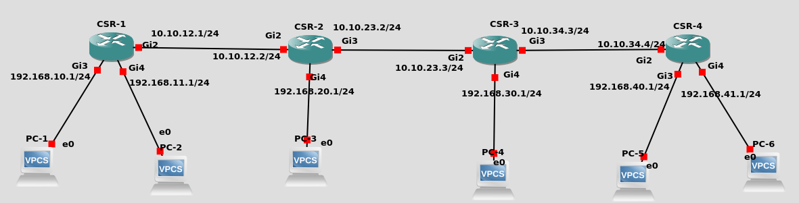

# netconf-static-route
Configure Cisco IOS XE Static Route using NETCONF

This repository contains scripts to configure Static Route on Cisco IOS XE devices automatically using Python and NETCONF. Before using this repository, please refer to https://github.com/arrosid/netconf-ip-address to configure IP Address on IOS XE using NETCONF.

<h3>Topology</h3>
This is the topology that we use in this repository. 

This is the same topology that we used in the https://github.com/arrosid/netconf-ip-address

<h3>Requirements</h3>
<ul>
	<li>Python 2.7 or Python 3.4+</li>
	<li>ncclient 0.6.3 or later</li>
</ul>

<h3>Supported Devices</h3>
<ul>
	<li>This script tested with Cisco IOS XE devices</li>
  <li>If you don't have any IOS XE in your environments, you can use Always On IOS XE Cisco Sandbox provided by Cisco DevNet.
    <ul>
      <li>Host: ios-xe-mgmt.cisco.com</li>
      <li>SSH Port: 8181</li>
      <li>NETCONF Port: 10000</li>
      <li>Username: root</li>
      <li>Password: D_Vay!_10&</li>
    </ul>
</ul>

<h3>How To Use</h3>
<ul>
	<li>Install the libraries listed in the requirements</li>
	<li>Configure IP Address Management in the router</li>
  <li>Configure IP Address on all of the router interfaces. Please refer to https://github.com/arrosid/netconf-ip-address.</li>
	<li>Activate NETCONF and YANG in the router using these commands</li>
    <ul>
      <li>netconf ssh</li>
      <li>netconf-yang</li>
    </ul>
	<li>Edit the inventory.yml to adjust to your topology</li>
	<li>Run the script using the command <i>python3 configure_static_route.py</i></li>
</ul>
